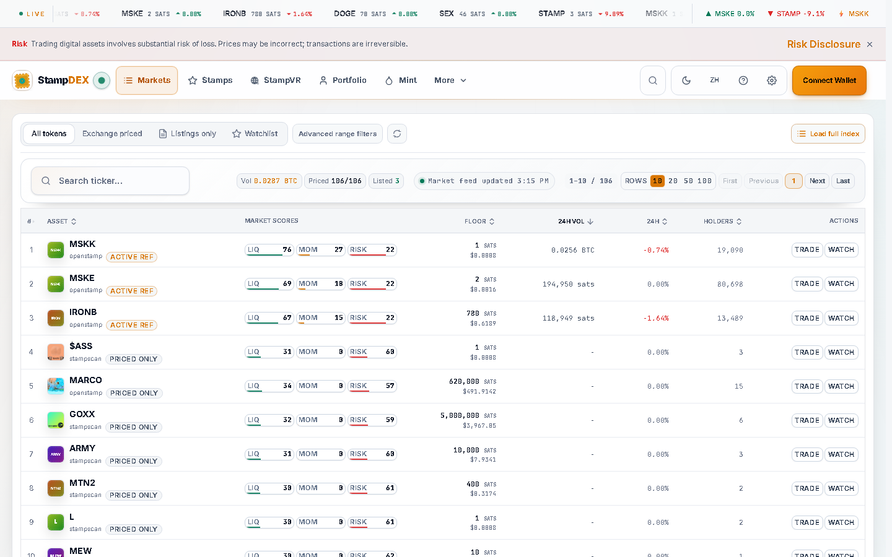

# StampDEX documentation

**The public documentation site for [StampDEX](https://stampdex.fun), the trading
venue for Bitcoin Stamps and SRC-20.**

> **[Read the documentation](https://bitcoinuniverseio.github.io/docs-stampdex/)**

This repository holds the source of that site. The product itself is a separate,
private application; this is its public documentation.

<picture>
  <source media="(prefers-color-scheme: dark)" srcset="assets/home-dark-desktop.png">
  
</picture>

## What the site covers

49 pages across nine sections.

| Section | What is in it |
| --- | --- |
| Start | What StampDEX is, a five minute orientation, and the exact list of actions that work |
| Browse | The market board, token pages, collection pages, and the portfolio |
| Trade | Buying, selling, cancelling, repricing, collecting stamps, listing stamps, and reviewing a PSBT |
| How settlement works | Custody at every stage, the order state machine, the settlement pipeline, offers, and recovery |
| Identity and data | Asset identity, deployment identity, market data, unknown against zero, provenance, and freshness |
| Reference | Fees, wallets, the capability matrix, order states, and a glossary |
| API | Quick start, rate limits, market, stamps, orders, media, status, and worked examples |
| Safety and support | Safety and trust, troubleshooting, and the FAQ |
| Project | Changelog, release evidence, page freshness, and contributing |

## The three things it says that most marketplace documentation does not

**Where your money is at every moment.** An SRC-20 trade routes the buyer's payment
through escrow addresses StampDEX controls until the tokens arrive.
[Where your funds are](https://bitcoinuniverseio.github.io/docs-stampdex/concepts/custody/)
draws that stage by stage, for both protocols, so a pending settlement is never
mistaken for a lost payment.

**Which actions are actually supported, and why the others are not.** The capability
tables are generated from the Bitcoin Universe ecosystem registry, and every
unsupported action carries the registry's own recorded reason. Neither protocol
supports an in-place listing price update: listings must be cancelled and relisted,
because no atomic listing update is implemented. See
[What you can and cannot do](https://bitcoinuniverseio.github.io/docs-stampdex/capabilities/).

**What has and has not been verified.**
[Release evidence](https://bitcoinuniverseio.github.io/docs-stampdex/project/release-evidence/)
states, action by action, which paths have recorded mainnet evidence and which are
implemented and deployed without it.

## Grounding

| Claim type | Checked against |
| --- | --- |
| Which marketplace actions are supported | The ecosystem capability registry in `bitcoinuniverseio/core`, via the published snapshot, vendored here as `src/data/registry.json` |
| Product behaviour, fees, timeouts, error strings | The private `bitcoinuniverseio/stampdex` application source |
| Live values: version, index lag, fee rates | The public API at `https://stamp.api.bitcoinuniverse.io` |
| Screenshots | Real captures from production on 2026-08-28. Nothing here is a mockup |

Every page carries a **Source and verification** panel under its title naming the
owning repository, the source path, the applicable release, the chain and network, the
lifecycle, and the date it was last checked.

## Building it

```bash
npm install
npm run dev      # local preview
npm run build    # static build into dist/, including the Pagefind search index
npm test         # runner policy, copy guard, manifest validation
npm run check:links   # internal links and anchors, after a build
```

Astro and Starlight, deployed to GitHub Pages by `.github/workflows/pages.yml`. No
external CDNs, no web fonts, no analytics, and no trackers. Content pages work with
JavaScript disabled; JavaScript adds search and the theme toggle only.

## Contributing

Corrections are the most valuable contribution here. See
[CONTRIBUTING.md](CONTRIBUTING.md) and the
[contributing page](https://bitcoinuniverseio.github.io/docs-stampdex/project/contributing/).

## Support and security

- Documentation problems: [issues in this repository](https://github.com/bitcoinuniverseio/docs-stampdex/issues)
- Product bugs: [issues in the application repository](https://github.com/bitcoinuniverseio/stampdex/issues)
- Suspected security problem: see [SECURITY.md](SECURITY.md). Email
  `legal@bitcoinuniverse.io` and do not open a public issue.
- Everything else: [SUPPORT.md](SUPPORT.md)

## Licence

Documentation content is licensed under
[CC BY 4.0](LICENSE). The StampDEX application itself is proprietary; this repository
documents it publicly.
