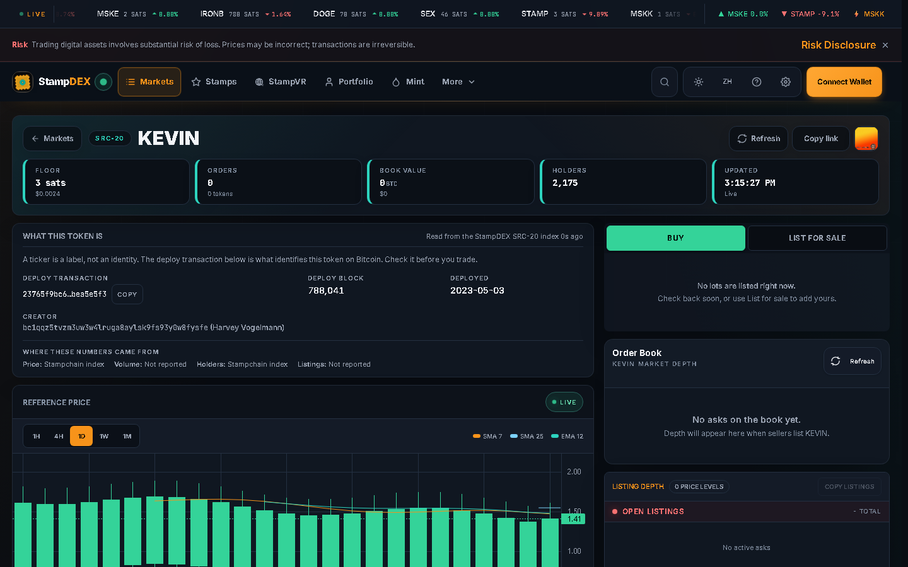
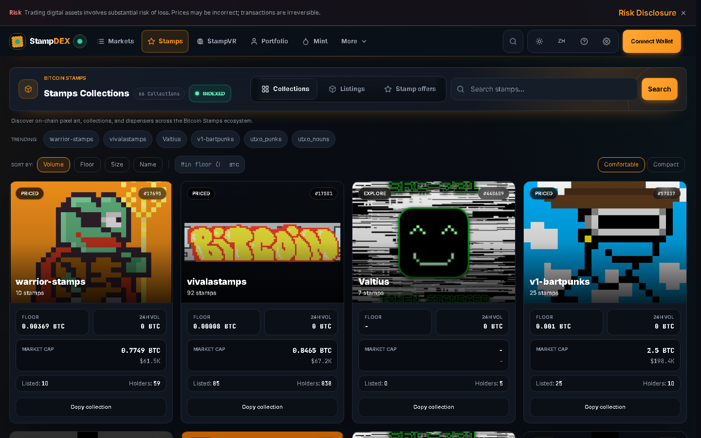
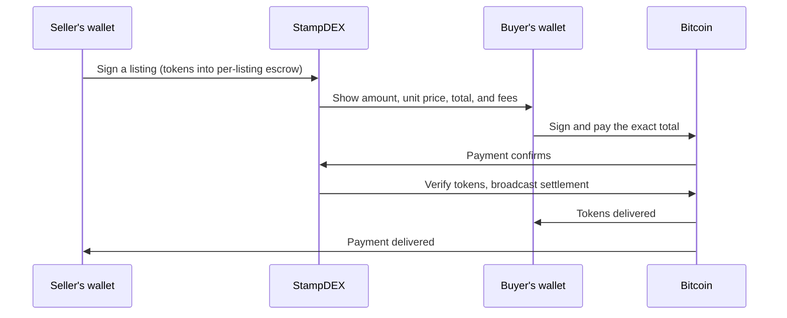

# StampDEX

**Trade SRC-20 tokens and collect Bitcoin Stamps, with every number
naming its source and every transaction shown before you sign.**

StampDEX is the SRC-20 marketplace and Bitcoin Stamps explorer at
[stampdex.fun](https://stampdex.fun). Browse everything without a wallet.
Connect one only when you want to trade.

<picture>
  <source media="(prefers-color-scheme: dark)" srcset="assets/home-dark-desktop.png">
  
</picture>

[Launch StampDEX](https://stampdex.fun) ·
[Start here](docs/start-here.md) ·
[Buy](docs/buy-src20.md) ·
[Sell](docs/sell-src20.md) ·
[Collect](docs/collect-stamps.md) ·
[API](docs/api/quickstart.md) ·
[Safety](docs/safety.md)

## What makes it different

- **Every number names its source.** Each market row carries a source
  label, and `GET /api/v1/indexer/status` reports the live index source,
  its lag behind the Bitcoin tip, and whether Universe or a third party
  operates it. See [Data sources](docs/data-sources.md).
- **Unknown is never zero.** A value the source did not answer shows as
  unknown. StampDEX does not fill gaps with zeros or invented numbers.
- **Identity before price.** Tokens show their deployment transaction and
  block; stamps show their number, asset id, creator, and file hash. A
  ticker alone never stands in for identity. See
  [Asset identity](docs/asset-identity.md).
- **You sign what you see.** Trades are PSBTs your own wallet reviews and
  signs, with the amount, price, total, and every fee shown first. Your
  keys never leave your wallet.
- **Your BTC does move through us.** While an SRC-20 trade settles, your
  payment sits in a trade address StampDEX controls, and the seller is paid
  only when the tokens reach you. StampDEX says so before you sign, and
  every order says where the money is. See
  [Orders and settlement](docs/orders-and-settlement.md).
- **A quiet market looks quiet.** No fake urgency, no invented volume, no
  countdown theater. What you see traded, traded.

## The product

<table>
  <tr>
    <td width="50%">
      
      <p><b>The token terminal.</b> Deployment identity, order book, price history, and the source of every figure, on one page.</p>
    </td>
    <td width="50%">
      
      <p><b>The stamps explorer.</b> On-chain artwork, collections, listings, offers, and dispensers, image first.</p>
    </td>
  </tr>
</table>

## How a trade works



Every state along the way is named on the order page, with where the funds
are and the transaction ids to verify. See
[Orders and settlement](docs/orders-and-settlement.md).

## Documentation

| I want to | Read |
| --- | --- |
| Understand the product in five minutes | [Start here](docs/start-here.md) · [What is StampDEX](docs/what-is-stampdex.md) |
| Buy or sell SRC-20 tokens | [Buy](docs/buy-src20.md) · [Sell](docs/sell-src20.md) · [Fees](docs/fees.md) |
| Collect Bitcoin Stamps | [Collect stamps](docs/collect-stamps.md) · [Asset identity](docs/asset-identity.md) |
| Follow a trade | [Orders and settlement](docs/orders-and-settlement.md) · [Troubleshooting](docs/troubleshooting.md) |
| Track my holdings | [Portfolio](docs/portfolio.md) · [Wallets](docs/wallets.md) |
| Trust but verify | [Safety](docs/safety.md) · [Data sources](docs/data-sources.md) · [Market data](docs/market-data.md) |
| Build on the API | [Quick start](docs/api/quickstart.md) · [Market](docs/api/market.md) · [Stamps](docs/api/stamps.md) · [Orders](docs/api/orders.md) · [Media](docs/api/media.md) |
| Look something up | [FAQ](docs/faq.md) · [Glossary](docs/glossary.md) |

## Wallets

Universe Wallet, UniSat, Leather, Xverse, and OKX Wallet. Connecting is not
the same as being able to do everything: OKX Wallet signs Bitcoin
transactions here but cannot list, cancel, or mint. What each wallet can do
is a table generated from the code that talks to it, in
[Wallets](docs/wallets.md).

Universe Wallet embeds the StampDEX trading desk directly.

## API in one line

```bash
curl https://stamp.api.bitcoinuniverse.io/api/v1/market/tokens?limit=5
```

No key needed for reads. 300 requests per minute per IP. Full docs in the
[API quick start](docs/api/quickstart.md).

## Data transparency

Bitcoin chain data comes from Universe-operated infrastructure. The
Stamps and SRC-20 index currently comes from stampchain.io, a third
party, and StampDEX says so in the product and in its status endpoint
rather than hiding it. The full map, and how to check it live, is in
[Data sources](docs/data-sources.md).

## Support

- Bugs and questions:
  [GitHub issues](https://github.com/bitcoinuniverseio/stampdex/issues)
- Suspected security problem: email `legal@bitcoinuniverse.io`, and do
  not open a public issue
- Corrections to these docs: [Contributing](docs/contributing.md)

## License

This documentation is (c) Bitcoin Universe. The StampDEX application is
proprietary; this repository documents it publicly.
